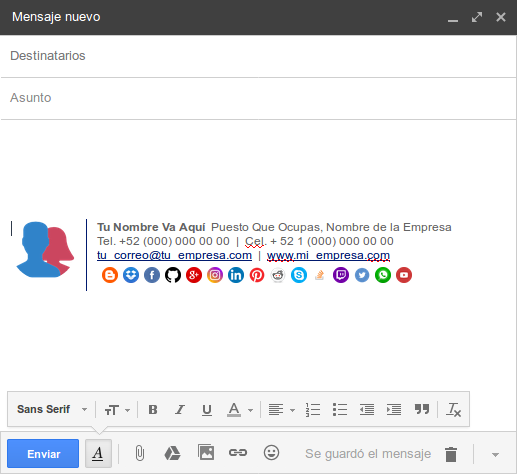

# Firmas de correo

La idea de éste repo es que cualquier persona que lo desee pueda generar su firma de correo para personalizar sus mensajes.
Por supuesto, todo de manera gratuita.

## ¿Cómo generar mi firma?

Para generar tu firma de correo necesitarás descargar un archivo de éste repositorio y deberás modificarlo para generar tu firma personalizada.
No te preocupes si no sabes programar, te dire como generar tu firma paso por paso.

### Primer paso
Lo primero que deberás hacer es descargar el código fuente de la firma, está contenido en el archivo:
> firma.htm

### Segundo paso
Una vez descargado el archivo, deberás abrirlo con algún editor de texto, por ejemplo: 
> __bloc de notas__, __sublime text__, __atom__  

Dentro del archivo deberemos modificar los datos de ejemplo por nuestros reales. 
Los datos que modificaremos dentro del archivo son los siguientes:

Dato | Descripción
-----|------------
Imagen de perfil | Corresponde a una imagen representativa de nuestro perfil, por ejemplo un fotografía de nosotros.
Nombre | Corresponde a nuestro nombre, puede ser completo o solo con un apellido. También puede incluir el grado de estudios, por ejemplo IS que significa ingeniero en software.
Puesto | Corresponde al puesto que actualmente desempeñamos en nuestro trabajo, por ejemplo Empleado de Mostrador, Gerente de Ventas, etc.
Teléfono | Corresponde al número de teléfono de la oficina del lugar donde trabajamos, si no hay podemos eliminar los valores de ejemplo y omitirlo.
Celular | Correpsonde a nuestro número de celular (es opcional), si no queremos inlcuirlo eliminamos los valores de ejemplo y lo omitimos.
Correo electrónico | Aunque es redundane, es necesario incluir nuestro correo electrónico para dar más profesionalismo a nuestra firma.
Página Web | Corresponde a la página o sitio web de la empresa.
Redes sociales o servicios de Internet | Corresponde a las redes sociales que actualmente utilizamos, hasta ahora solo se consideraron 15 redes sociales, cualquiera de ellas que no utilices puedes eliminarla.

Todos los datos mencionados en la tabla anterior deberas sustiuirlos por los valores de ejemplo.
Es sencillo identificar los datos de ejemplo en el archivo ya que todos se encuentran después de un pequeño comentario (cada comentario está escrito entre estós "<!--" y "--!>").
Un ejemplo de comentario es el siguiente:  
> '<!-- Sustituye tu nombre aquí --!>'
Al final, después de cambiar los datos de ejemplo por tus datos reales deberás guardar el archivo.

#### Redes sociales
Las redes sociales u otros servicios de Internet que puedes utilizar en tu firma son:   
__blogger__, __dropbox__, __facebook__, __github__, __google-plus__, __instagram__, __linkedln__, __pinterest__, __reddit__, __skype__, __stackoverflow__, __twich__, __twitter__, __whatsapp__ y __youtube__

### Tercer paso
Después de modificar el archivo y guardarlo, deberás abrir el archivo con el navegador, por ejemplo:
* Si el navegador ya está abierto, arrastra y suelta el archivo sobre el navegador.
* Haz clic derecho sobre el archivo y elige la opción de Abrir con.. y selecciona un navegador.

Una vez que lo abras en el navegador, verás el siguiente resultado:
   
_Nota: la imagen anterior corresponde a una firma de correo con los datos de ejemplo incluidos en el archivo firma.htm_

### Cuarto paso
Una vez que ya tenemos nuestra firma de correo lista y montada en el navegador, deberemos seleccionarla y copiarla como se muestra en la siguiente imagen:

   
_Nota: Para seleccionar toda la firma pueden utilizar Ctrl + A desde su teclado.

### Quinto paso
Ya estamos listos para configurar nuestra firma en el correo electrónico. Para ello nos dirigiremos a configuración y posteriormente a firma, ahí pegaremos lo que copiamos del navegador.  
La siguiente imagen muestra la configuración de la firma en Gmail:

   

### Listo!!!
Hemos terminado de generar y configurar nuestra firma de correo, 
a partir de ahora aparecerá automáticamente al enviar nuevos correos así como se muestra en la siguiente imagen:  
   
